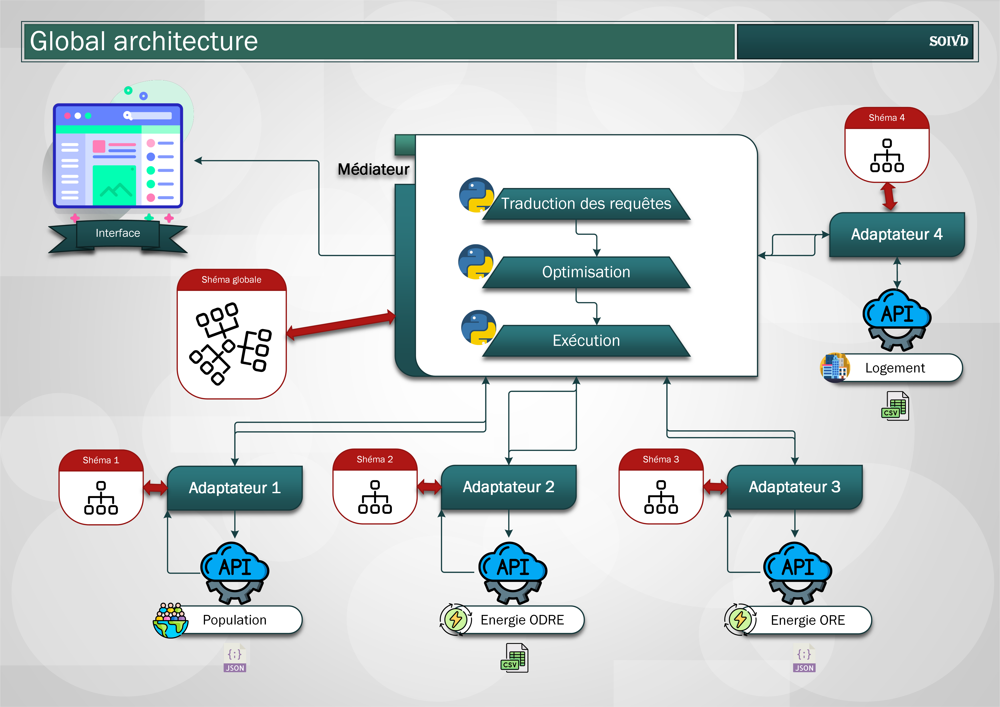
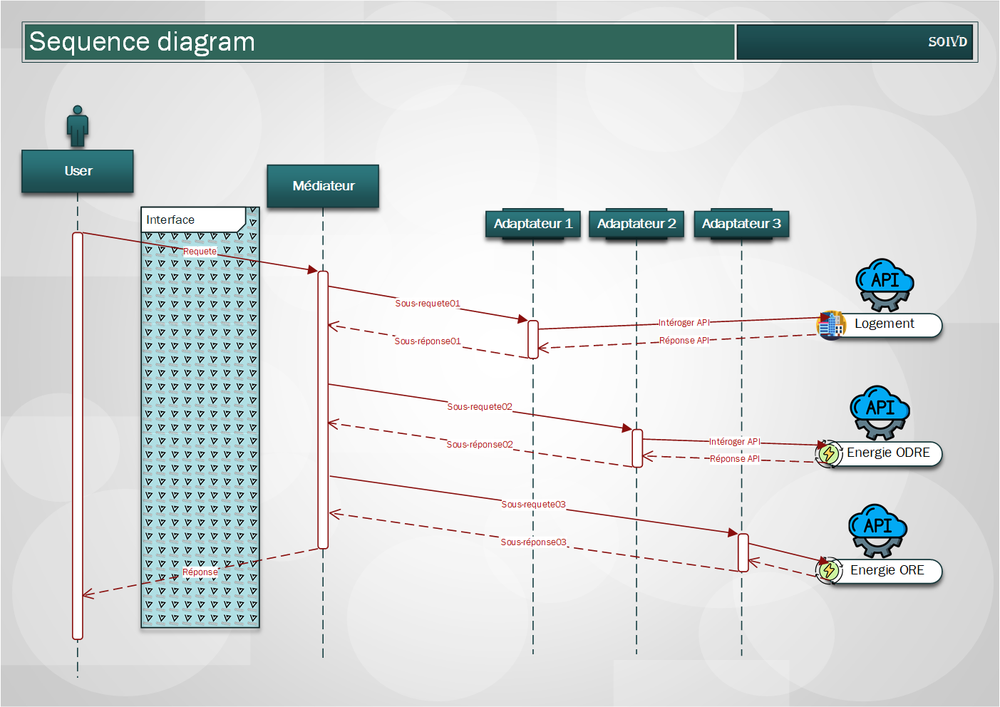

# SOIVD – Système Optimisé d’Intégration Virtuelle de Données


# **Projet Chef d'œuvre** 
### **Université Toulouse III - Paul Sabatier**

Membres du groupe :

- ERREBIAI Chaimae : chaimae.errebiai2@gmail.com
-	KEBIRI Issam Eddine : kebiri.isam.dine@gmail.com 
-	GHORBEL Ahmed Amine : ghorbelahmedaminelfet@gmail.com 
-	HADDOU khalid : khalidhaddou99@gmail.com 
-	ABAKAR Issa : issaabakar17@gmail.com 

Responsable pédagogique :
- SHAOYI Yin : shaoyi.yin@irit.fr

## About The Project
Le but de ce projet est de créé un Système Optimisé d’Intégration Virtuelle De
Données – SOIVD qui exploitera différentes bases de données en relation avec
l’énergie et la météo afin d’apporter une analyse du contexte actuel de crise
d'énergies.
##### Contexte
● Évolution vers de grosses quantités de données (Big Data)     
● Plusieurs sources d’informations (SGBD relationnels, fichiers, applications, pages Web ...)    
● Des données de plus en plus hétérogènes et interfaces d’accès variées (langages d’interrogation, modèle de données, interfaces d’appel …)   

##### Solution proposée  
Un Système Optimisé d’Intégration Virtuelle De Données - SOIVD avec une
architecture médiateur-adaptateur et une capacité d’intégration de plusieurs sources
de données hétérogènes.

##### Objectif
Un accès uniforme à des sources multiples, autonomes et hétérogènes et structurés


#### Built With
- Python
- Flask
- Pandas
- APIs

## Installation

Use the package manager `pip` to install     
```bash
pip install -r requirements.txt
```
OR      

Use the package manager `pip` to install 

```bash
pip install pandasql
pip install contextlib
pip install bs4
pip install dateutil
```

## Packages

json : https://docs.python.org/2/library/json.html

requests : https://fr.python-requests.org/en/latest/

dateutil : https://dateutil.readthedocs.io/en/stable/

pandas : https://pandas.pydata.org/docs/

pandasql : https://pypi.org/project/pandasql/

termcolor : https://pypi.org/project/termcolor/

urllib : https://docs.python.org/fr/3/library/urllib.html

BeautifulSoup : https://www.crummy.com/software/BeautifulSoup/bs4/doc/

contextlib : https://docs.python.org/3/library/contextlib.html

## Conception
La figure ci-dessus représente l’architecture adoptée pour la réalisation du présent projet. Il s’agit d’une architecture Adaptateur-Médiateur dont on va utiliser l’approche GAV


Diagramme de séquence


Diagramme de Gantt


## Datasets

Choix des BDs : Nous avons choisi les bases de données par rapport aux contextes de crise de l’énergie, nous exploiterons donc deux API contenant des données relatives à la consommation gaz et électricité dans différentes régions, le troisième API quant à lui contient des données de population en France, et le dernier API contient un jeu de données des informations sur les logements en France.

### Description des APIs

| API                                                                                                                                 | Description                                                                                                                       |
| ------------------------------------------------------------------------------------------------------------------------------------- | ------------------------------------------------------------------------------------------------------------------------- |
| [API Logement](<https://opendata.caissedesdepots.fr/pages/pagehomerefonte/>) | Le jeu de données sur les logements disponible sur le site opendata.caissedesdepots fournit des informations sur les logements en France. Ces données sont recueillies auprès de différents acteurs du marché immobilier et incluent des informations sur les transactions immobilières, les prix de vente, les caractéristiques des logements, etc. |
| [API Energie ODRE](https://odre.opendatasoft.com/explore/dataset/conso-epci-annuelle/information/?disjunctive.libelle_epci&disjunctive.libelle_departements&disjunctive.libelle_regions&disjunctive.e_operateurs&disjunctive.g_operateurs) | Ce jeu de données rendu disponible par la plateforme d'Open Data Réseaux Énergies (ODRÉ) est constitué à partir des données locales de consommation finale en MWh publiés par le ministère de la Transition écologique et solidaire (état au 01/10/2020), regroupées par EPCI (établissements publics de coopération intercommunale), les données sont multiénergies, multiopérateurs et multi-réseaux |
| [API Energie ODE](https://opendata.agenceore.fr/explore/dataset/conso-elec-gaz-annuelle-par-secteur-dactivite-agregee-epci/information/)  | Cette base de données issue de l’agence ORE (Opérateurs de Réseaux d’Énergie) qui est une alliance de tous les distributeurs français d'électricité et de gaz permet de visualiser l’évolution de 2011 à 2021 des consommations d'électricité et de gaz par secteur d'activité (résidentiel, tertiaire, industriel, agricole ou non affecté) et par EPCI (établissements publics de coopération intercommunale). 
| [API Population](https://public.opendatasoft.com/api/records/1.0/search/?dataset=demographyref-france-pop-legale-commune-arrondissement-municipal-millesime&q=&rows=3536&facet=reg_code&facet=reg_name&facet=com_arm_code&facet=com_arm_name&facet=dep_code&facet=arrdep_code&facet=census_year&facet=start_year&facet=geo_year&facet=epci_name&facet=epci_code&facet=dep_name/)  | Le jeu de données de population disponible sur le site public.opendatasoft fournit des informations démographiques sur les communes et arrondissements municipaux en France. Les données incluent le nombre d'habitants par commune, la densité de population, la répartition par sexe et par tranche d'âge, ainsi que des informations sur les migrations et les naissances, le jeu de données couvre plusieurs années.  |


## Mise en place de l'environnement Flask
 - Création d'un environnement virtuel soit avec anaconda soit avec la commande -m venv <environment name> sous python
 - Dans le cas où l'env virtuel est crée par Anaconda, il faut spécifier dans le anaconda prompt : conda activate <environment name>
 - Pointer sur le dossier API_ConsommationElectriciteGaz (./API_ConsommationElectriciteGaz)
 - Installer les bibliothèques nécessaires dans le fichier requirements.txt (Flask, requests, json, ...)
#### Exploration de l'architecture du projet flask 
 - Dossier static : contient tous les fichiers de style et les images si vous aurez besoin
 - Dossier templates : contient tous les fichiers html pour la partie front-end du projet
 - Fichier app.py : pour définir le logique et les endpoints
#### Exécution de l'app Flask
 - Dans la commande prompt d'anaconda : 
     1) set FLASK_APP=app.py
     2) set FLASK_ENV=development
     3) flask run
 - Taper dans l'url :  http://127.0.0.1:5000/
 - Obtenir les résultats affichés dans la page web
 
#### Affichage:


## Références:
 - Anaconda : https://www.anaconda.com/products/distribution
 - Flask : https://flask.palletsprojects.com/en/2.2.x/
 - Environnement vituel : https://pypi.org/project/virtualenv/ && https://anaconda.org/conda-forge/virtualenv


